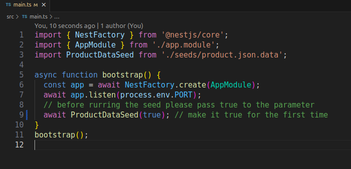
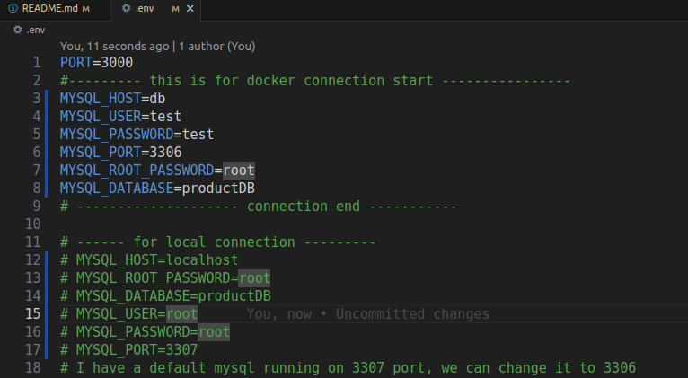
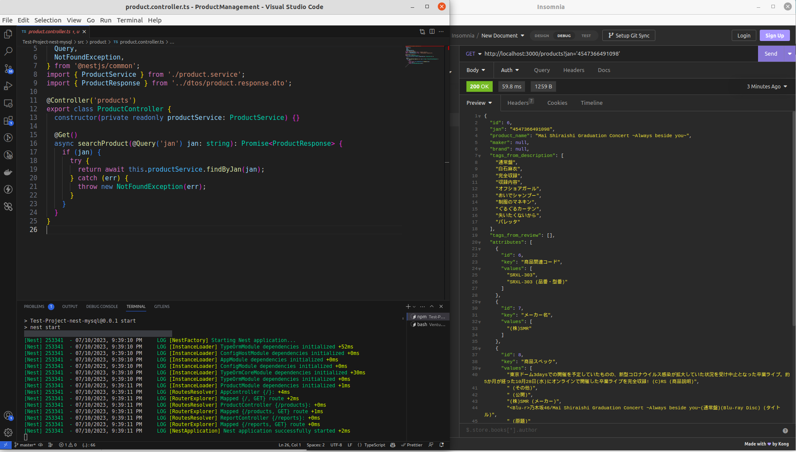
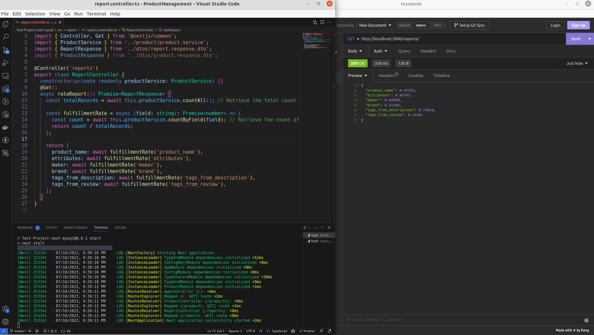
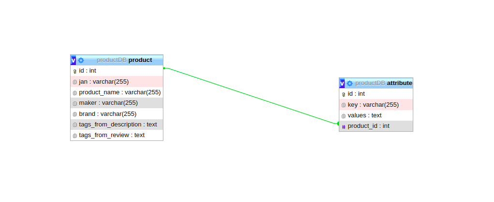

# Product Search with docker MYSQL typeORM
## Table of contents
* [General info](#general-info)
* [Technologies](#technologies)
* [Setup](#setup)
* [Project OutPut](#project-output)
* [DB Schema ER Diagram](#DB-Schema-Diagram)

## General info
This project is for test purpose. Here, you can see
1. How to seed a huge json file using file stream 
2. docker file consists of application and mySQL server running. you can use docker compose file for running the application and DB Server
3. In the Data folder you will have the full seeded sql script.
4. DB ERD diagram in the Submission_2_ERD_Diagram_image folder
	
## Technologies
Project is created with:
* NestJs
* TypeORM
* TypeScript
* MySQL
* Docker
	
## Setup
To run this project, install it locally using npm:

1. If you want to run this project locally
  * $ cd ProductSearch_Report_with_docker_mySQL_typeORM
  * npm install
  * in the .env file update mysql configuration for local connection, update MYSQL_PORT: 3306
  * If you want to run the seed please update code like below and after running first time please update ProductDataSeed(false)
     * 
  * npm run build
  * npm run start
  * project will run on 'http://localhost:3000'
2. If you want to run this project in Docker
  * update the .env file like below
    * 
  * If you want to run the seed please update code like below and after running first time please update ProductDataSeed(false)
    * 
  * then run docker-compose up --build, it will run the mysql and application
## Project OutPut
This Project consist two controller (Product and Report)

Output from controllers:
1. If we want a product by Jan http://localhost:3000/products?jan='4547366491098' , here is the output
    * 
2. If we want to see the reports http://localhost:3000/reports/, You can see the result is returning in <b> 336 miliseconds<b> here is the output
    * 

## DB Schema ER Diagram
This is the DB Schema Diagram with relation:
* 

Improvement Area:
1. Here I didn't restrict db fields like we can fix the length of the string fields
2. We could use the JSON option to store the data.
3. I will prefer MongoDB for storing this kinds of data and also for query optimization and DB Scaling we could use the Sharding feature of MongoDB. 
4. We can cache the Get query response in Redis for avoiding frequent call in DB. 

